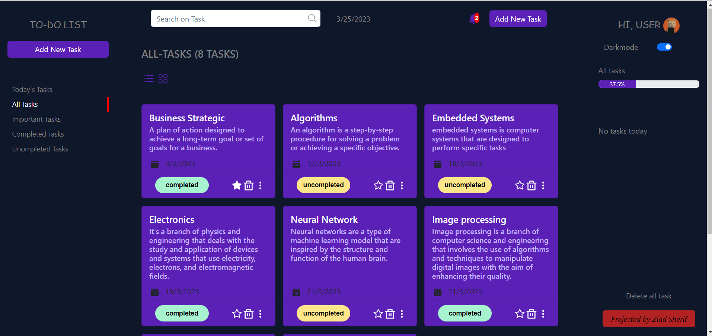
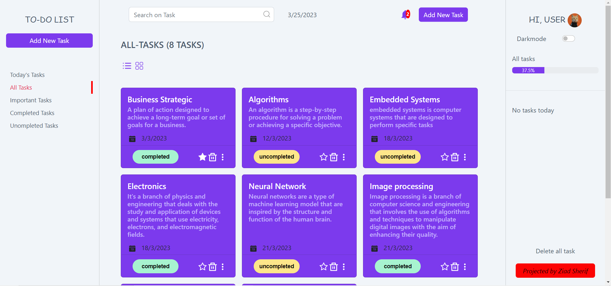
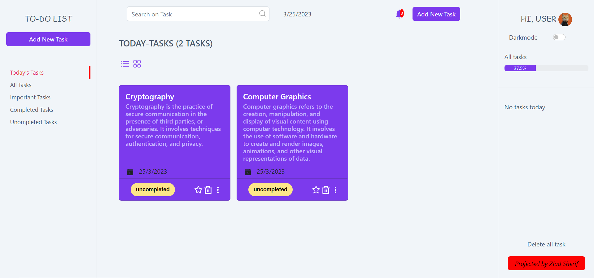
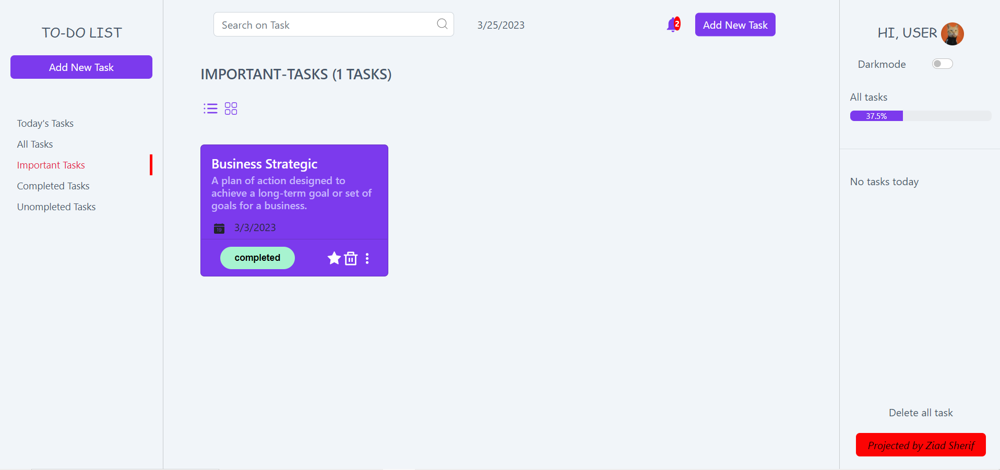
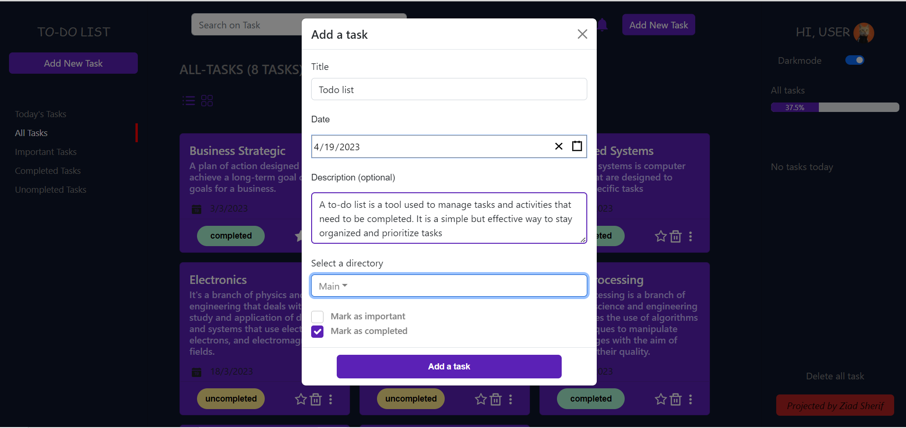
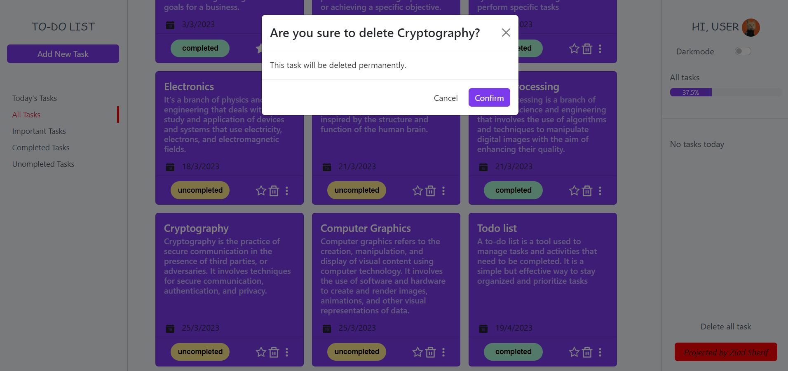
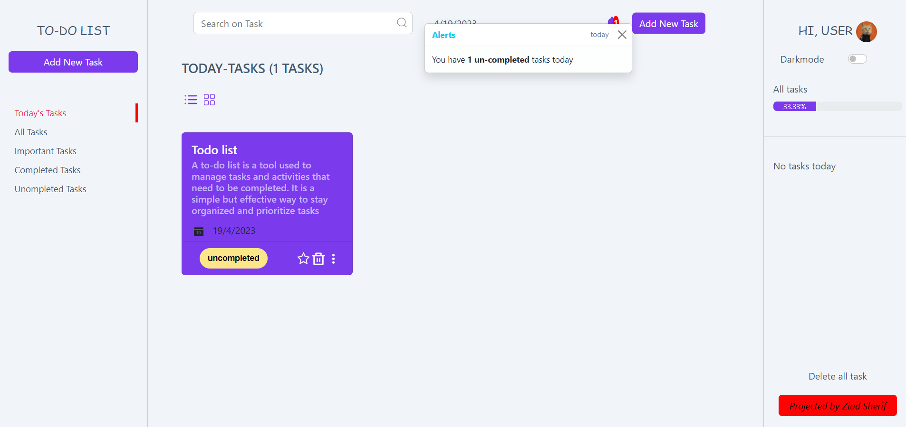
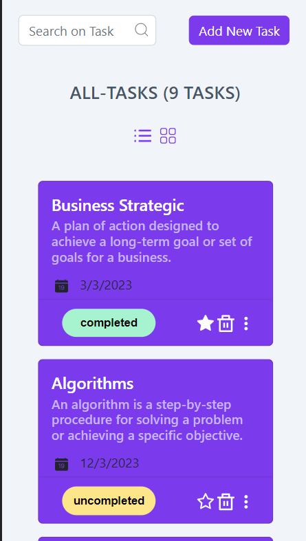

<div align="center">

</div>

<div align="center">

[](https://github.com/ZiadSheriif/Todo-List/contributors)
[](https://github.com/ZiadSheriif/Todo-List/issues)
[](https://github.com/ZiadSheriif/Todo-List/blob/master/LICENSE)
[](https://github.com/ZiadSheriif/Todo-List/network)
[](https://github.com/ZiadSheriif/Todo-List/stargazers)
[](https://img.shields.io/github/languages/count/ZiadSheriif/Todo-List)

</div>

## 📝 Table of Contents

- [📝 Table of Contents](#-table-of-contents)
- [📙 About ](#-about-)
- [🌠 Features ](#-features-)
- [📂 Folder Structure ](#-folder-structure-)
- [🏁 Getting Started ](#-getting-started-)
  - [Prerequisite ](#prerequisite-)
  - [Installation ](#installation-)
  - [Running ](#running-)
- [💻 Built Using ](#-built-using-)
- [📸 Demo Screens ](#-demo-screens-)
- [🕴 Contributors ](#-contributors-)
- [⏳ Backlog](#-backlog)
- [📃 License ](#-license-)

## 📙 About <a name = "about"></a>

A to do List application that allows users to create and manage their tasks. It provides a simple and intuitive interface for users to add, edit, delete, and complete tasks.


## 🌠 Features <a name= "features"></a>
1. Ability to add new tasks.
2. Ability to view tasks based on different categories, **_such as_** 
   - Today's Tasks
   - All Tasks
   - Important Tasks
   -  Completed Tasks
   -  Uncompleted Tasks
3. Ability to mark tasks as **completed** or **uncompleted**.
4. Ability to edit and delete tasks.
5. Ability to search for tasks using a search bar.
6. Responsive design that works well on desktop and mobile devices.
7. Integration with local storage to persist data between sessions.


> [!NOTE]
> I am still working on the project, this is not the final verison of it, I just make it public to get feedback and imporve it

## 📂 Folder Structure <a name= "folder-structure"></a>

```sh
├───Assets
│   └───images
├───Components
│   ├───CardTask
│   ├───DeleteTaskModal
│   ├───LeftSideBar
│   ├───RightSideBar
│   ├───SearchBar
│   ├───TaskModal
│   └───ToastModal
├───Hooks
├───Layouts
│   ├───Header
│   └───ShowTasks
├───Pages
│   └───HomePage
├───Theme
└───Utils
```
## 🏁 Getting Started <a name = "get-started"></a>

> This is an list of needed instructions to set up your project locally, to get a local copy up and running follow these
> instructuins.

### Prerequisite <a name = "req"></a>

1. Node.js

### Installation <a name = "Install"></a>

1. **_Clone the repository_**

```sh
$ git clone https://github.com/ZiadSheriif/Todo-List.git
```

2. **_Navigate to TodoList Folder_**

```sh
$ cd TodoList
```

### Running <a name = "running"></a>

**_Running program_**

1. **_Install modules_**

```sh
npm install 
```
2. **_Start program_**

```sh
npm start
```
## 💻 Built Using <a name = "tech"></a>

- **ReactJs**
- **React Bootstrap**

## 📸 Demo Screens <a name = "screens"></a>

<div align="center">
<h3 align='left'>All Tasks</h3>
   
<h3 align='left'>Today's Tasks</h3>
   

<h3 align='left'>Important Tasks</h3>

<h3 align='left'>Completed Tasks</h3>

<h3 align='left'>Add task</h3>

<h3 align='left'>Edit task</h3>

<h3 align='left'>Delete task</h3>

<h3 align='left'>Notifications</h3>

<h3 align='left'>Responsitivity</h3>

</div>

## 🕴 Contributors <a name = "Contributors"></a>

<table>
  <tr>
    <td align="center">
    <a href="https://github.com/ZiadSheriif" target="_black">
    
    <br />
    <sub><b>Ziad Sherif</b></sub></a>
    </td>
    
    
  </tr>
 </table>

 ## ⏳ Backlog
 - [x] ~~Add a feature to categorize tasks, allowing users to filter tasks by category.~~
 - [x] ~~Implement a due date feature that allows users to set a due date for tasks and receive reminders when tasks are approaching their deadline.~~
 - [x] ~~Add the ability to sort tasks by various criteria, such as due date, priority, or category.~~
 - [ ] Store tasks in a JSON file instead of local storage. 
 - [x] ~~Implement a search functionality to enable users to search for specific tasks by keyword or phrase.~~
 - [x] ~~Add the ability to prioritize tasks by assigning them different levels of importance or urgency.~~
 - [ ] Implement a calendar view that shows tasks on a monthly or weekly calendar, making it easier for users to plan and manage their tasks.
 - [ ] Add directory that user can attach task in a sub directory.
 - [ ] Implement authentication and authorization features to allow users to create and manage their own tasks.
 - [ ] Allow users to drag and drop tasks to rearrange their order or move them between categories.
 - [x] ~~Ability to filter tasks by status (all, active, completed).~~
 - [x] ~~Ability to edit task details.~~ 


## 📃 License <a name = "license"></a>

> This software is licensed under MIT License, See [License](https://github.com/ZiadSheriif/Todo-List/blob/main/LICENSE) for more information ©ZiadSheriif.
